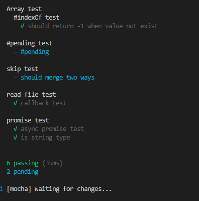

# webpack-dev-server 启动报错 Error: Cannot find module ‘webpack-cli/bin/config-yargs‘

- 原因
  - 由于 webpack-cli 版本 4，删除了 webpack-cli/bin/config-yargs 文件，看图 bin 目录下没有 config-yargs.js
- 解决办法
  - npm uninstall webpack-cli
  - npm i webpack-cli webpack-cli@3.3 -S
- 文件指纹
  - js :chunkhash (入口文件)
  - css 添加文件指纹(contenthash)：因为默认情况下打包好的 css 是通过 style-loader 添加到 head 中，想要给 css 添加文件指纹，先通过 mini-css-extract-plugin 将 css 提取出单独的文件
- 文件压缩
  - js 内置 ugliftjs-webpack-plugin
  - css optimize-css-assets-webpack-plugin + csscano
  - html html-webpack-plugin
- css 增强
  - 删除 打包文件
  - 添加前缀 postcss-loader autoprefixer
- devtool
  - eval :打包后的代码包裹在 eval 中，并且用 sourceURL 连接到源码文件中 不好 debugger
  - cheap-source-map : 源代码 没有包裹在 eval 中，可以调试
- import 懒加载 文件，用到的时候才去加载（babel 转换）
  - npm install @babel/plugin-syntax-dynamic-import --save-dev
  - babelrc 文件 配置 plugins:["@babel/plugin-syntax-dynamic-import"]
- 打包 ssr
  - vue + webpack + ssr
  - vue-server-renderer 方法 createRenderer() 加载模板
  - render.renderToString 将页面渲染 返回浏览器
  - <!--vue-ssr-outlet--> 占位符
- 扩展 单元测试 mocha + chai 
  - npm i mocha -D
  - mocha file1 file2
  - /node_modules/bin/mocha file1 file2
  - mocha
  - mocha --watch 监听测试文件变化
  - [图片]
  - [Mocha和单元测试](https://segmentfault.com/a/1190000020346118)
  - [译 快速，完整的 Mocha 测试指南](https://learnku.com/articles/35165#1-%E4%BD%BF%E7%94%A8%E5%9B%9E%E8%B0%83%E6%96%B9%E6%B3%95)


- webpack构建速度分析
  1. stats （webpack 内置） 颗粒度粗，看不出问题所在
  ```
   package.json
      build:stats:webpack --config webpack.prod.js --json>stats.json
  ```
  2. speed-measure-webpack-plugin 可以看出每个loader和插件的耗时时间 
     
  ```
  npm install --save-dev speed-measure-webpack-plugin
  const smp = new SpeedMeasurePlugin();

   const webpackConfig = smp.wrap({
    plugins: [new MyPlugin(), new MyOtherPlugin()],
  });
  ```
- webpack 构建体积分析
  1. webpack-bundle-analyzer 可视化包分析大小 可以分析第三方模块或者自己编写的业务模块的大小，在8888端口展示大小 
  ```
    npm install --save-dev webpack-bundle-analyzer
    const BundleAnalyzerPlugin = require('webpack-bundle-analyzer').BundleAnalyzerPlugin;

    module.exports = {
       plugins: [
          new BundleAnalyzerPlugin()
       ]
    }
  ```
- 构建速度优化
  1. 使用高版本的webpack 和node.js
      - 可以直接将loader传给ast，减少了解析
      - 字符串代替正则
      - webpack4及以上版本使用md4 hash算法
      - V8 带来的优化(map和set代替object，contain 代替indexof ，forof 代替for循环等)
  2. 多进程多实例构建：
      - happypack ： 每次解析模块，会将模块及其依赖分配个worker;本例使用happypack后，时间从4587 到2458提升 [链接](https://github.com/amireh/happypack)  
      ```
            rules: [
            {
              test: /.js$/,
              // 1) replace your original list of loaders with "happypack/loader":
              // loaders: [ 'babel-loader?presets[]=es2015' ],
             use: 'happypack/loader',
             include: [ /* ... */ ],
             exclude: [ /* ... */ ]
            }
           ]
           // 2) create the plugin:
                  new HappyPack({
                      // 3) re-add the loaders you replaced above in #1:
                  loaders: [ 'babel-loader?presets[]=es2015' ]
               })
      ```
      - thread-loader:原理和happypack类似,[链接](https://github.com/webpack-contrib/thread-loader)
      ```
       [{
            test: /\.js$/, // 匹配js文件
            use: [
                {
                    loader: 'thread-loader',// 'happypack/loader'
                }, 
                'babel-loader?cacheDirectory=true',
                'eslint-loader']
            // ['babel-loader', 'eslint-loader'], // 使用babel-loader 进行解析
        }]
      ```
  3. 多进程多实例压缩
      - uglifyjs-webpack-plugin
      - terser-webpack-plugin 可以压缩ES6代码 
          这时安装的压缩版本是5.1，和webpack不兼容，会报错Cannot read property 'JavascriptModulesPlugin' of undefined，降低terser-webpack-plugin 即可
        ```
           optimization: {
              minimize: true,
              minimizer: [
                new TerserPlugin({
                  parallel: true, // 开启多线程 也可以是某个数字
                }),
              ],
            },
              
        ```
  4. 分包：包括基础包(vue ,vue-cli等) 和业务包，一般基础包分离较多 
        [文档](https://webpack.docschina.org/plugins/dll-plugin/#root)
      - 动态链接库: DllPlugin 和DllReferencePlugin 联合使用实现分包，大幅度提升构建速度
      - DllPlugin 可以将基础包或者业务包打包成一个单独的文件，并且会创建一个mainfest.json的文件，这个文件用于让DllReferencePlugin映射到相应的依赖上；
      - DllReferencePlugin 在原项目打包文件中引用json文件
  5. 缓存：提升二次构建速度,设置缓存，打包后会在node_modules 文件夹下面出现.cache文件夹
      - babel-loader :?cacheDirectory=true 
      ```
      rules: [{
            test: /\.js$/, // 匹配js文件
            use: [
                {
                    loader: 'thread-loader',// 'happypack/loader'
                }, 
                'babel-loader?cacheDirectory=true',
                'eslint-loader']
            // ['babel-loader', 'eslint-loader'], // 使用babel-loader 进行解析
        }]
      ```
      - terser-webpack-plugin
        ```
        minimizer:[
            new TerserPlugin({
                parallel: true,
                cache:true
            })
        ],
        ```
      - cache-loader 或者[hard-source-webpack-plugin](https://github.com/mzgoddard/hard-source-webpack-plugin) 和 speed-measure-webpack-plugin 插件不兼容 
  6. 缩小构建目标的范围：减少模块搜搜范围
     - resolve.modules:设置解析模块时搜索的目录，(绝对路径和相对路径都可以，但是有点区别) 默认是node_modules,使用绝对路径只在指定目录搜索；而相对路径则可以在父目录 祖父目录等搜索;
     - resolve.mainFields：定义查找package.json下面某个属性(如main 或者index)的文件
     - resolve.extensions：在导入文件没带后缀时，webpack会自动尝试带上后缀去询问文件是否存在，列表越长而正确的后缀越往后，需要的尝试次数越多，所以①列表尽可能小②使用频次越高的后缀越靠前③导入文件尽可能带上后缀
     - resolve.alias:通过别名将原导入路径映射，可以直接指定引用的第三方库的入口文件
- 构建体积优化
   1. tree-shaking:①个模块有很多方法，只要其中一个方法使用到了，那么整个文件都会打包到bundle中，    tree-shaking就是将用到的方法打包到bundle，没有用到的使用uglifyjs擦除调
        - 针对js webpack4 以上默认就使用treeshaking ;
        - 而针对删除无用的css ,有以下两种方式：
          - purifyCss:purgecss-webpack-plugin 搭配mini-css-extract-plugin 
          - uncss :通过jsDom加载，使用postcss解析代码，并且使用document.querySelector()识别不存在的css选择器；
   2. 图片压缩 :[image-webpack-loader](https://www.npmjs.com/package/image-webpack-loader)
      - [安装报错解决办法] (https://www.cnblogs.com/ccti7/p/13956678.html)
   3. 动态polyfill:polyfill-service
- webpack 源码分析
  1. 启动流程分析
     1. 命令行:
         - npm run dev(开发环境) / npm run build (生成环境)或者 webpack entry.js,本质上是查找webpack，先从node_modules/.bin目录下查找是否存在webpack.sh/webpack.cmd，如果存在，则执行，反之报错；从node_modules/webpack/package.json 中bin字段的值可以知道实际上执行的是./node_modules/webpack/.bin/webpack.js；
         - 局部安装webpack，如果想要在node_modules/.bin目录下有命令，则必须指定package.json文件中的bin字段
     2. webpack.js :这个文件主要是为了找webpack-cli/webpack-command.js 并且执行
  2. webpack-cli:对配置项和命令行进行分析并且转成成option；根据配置实例化webpack，并完成编译和构建
     1. 引入yargs，对命令行进行定制：
         - NON_COMPILATION_CMD 分析出不需要编译的命令，如果输入的命令在NON_COMPILATION_ARGS中存在，则不需要编译
     2. 对命令行参数进行分析
         - 对命令行参数进行分组(config/config-arg.js)，加上默认的option 共9大组
         - 将输入的命令行转换成webpack识别的配置项
         - 引入webpack，并将配置项传入webpack，返回compiler对象
  3. Tapable:钩子函数的发布订阅，控制着webpack插件系统，webpack可以看成事件流的编程范例，一系列插件运行：
     1. 上面的compiler对象继承自Tapable;
     2. Tapable提供了很多钩子（同步和异步），为插件提供挂载：
        |钩子|说明|
        | :----: | :----:|
        |SyncHook|同步钩子|
        |SyncBailHook|同步熔断钩子|
        |SyncWaterfallHook|同步流水钩子|
        |SyncLoopHook|同步循环钩子|
        |AsyncParallelHook|异步并发钩子|
        |AsyncParallelBailHook|异步并发熔断钩子|
        |AsyncSeriesHook|异步串行钩子|
        |AsyncSeriesBailHook|异步串行熔断钩子|
        |AsyncSeriesWaterfallHook|异步串行流水钩子|
     3. 钩子的绑定和执行
        |钩子|说明|
        | :----: | :----:|
        |同步|异步|
        |绑定:tapAsync/tapPromise/tap|绑定:tap|
        |执行:callAsync/promise|call|
     4. 钩子使用示例
         ```
           const hook1 = new SyncHook(["arg1", "arg2", "arg3"]);
            //绑定事件到webapck事件流
            hook1.tap('hook1', (arg1, arg2, arg3) => console.log(arg1, arg2, arg3)) //1,2,3
            //执行绑定的事件 hook1.call(1,2,3)
         ```
- loader 
  1. loader:就是一个导出为函数的js模块，它的执行顺序是从后往前，从右往左；
  2. 本地开发loader，可以借助[loader-runner](https://github.com/webpack/loader-runner) 进行调试，允许在不安装webpack 的情况下执行loader
     - loader-runner 作为webpack 的依赖，webpack 是使用它执行loader；
     - 允许loader的开发和调试
       ```
         const path = require('path');
         const fs = require('fs');
         const runLoaders=require('loader-runner')
         
         runLoaders.runLoaders(
             {
                 resource: path.join(__dirname, 'raw-loader-text.txt'), // 解析资源的路径（绝对路径）
                 loaders: [{
                     loader:path.resolve('./loader-runner/raw-loader.js'),
                     options:{
                         name:'test'
                     }
                 }], // 数组，可以传递多个loader
                 context: { minimize: true },
                 readResource: fs.readFile.bind(fs),
             },
             function (err, result) {
                 return err ? console.log(err) : console.log(result);
             }
         );
       ```
  3. loader 参数获取 loader-utils 中 getOptions 
     ```
        const loaderUtils=require('loader-utils')
        let obj=loaderUtils.getOptions(this)
        console.log('name:',obj.name)
     ```
  4. loader中的异常处理
     - 直接throw抛出异常 （同步loader）
     - this.callback(err||null,result) (同步loader)
     - this.async(err||null,result)(异步loader)
  5. 文件输出 this.emitFile(url,path)
      ```
           let url = loaderUtils.interpolateName(this, '[name].[ext]', source)
           console.log(url,'*****')
           this.emitFile(url, source)
      ```
- 合成雪碧图 [spritesmith](https://www.npmjs.com/package/spritesmith?activeTab=readme)
- 插件编写
  1. 没有像loader一样的独立运行环境
  2. 只能在webpack运行
  3. 插件类
     - 需要实现apply方法
     - module.exports 导出插件类
   
     